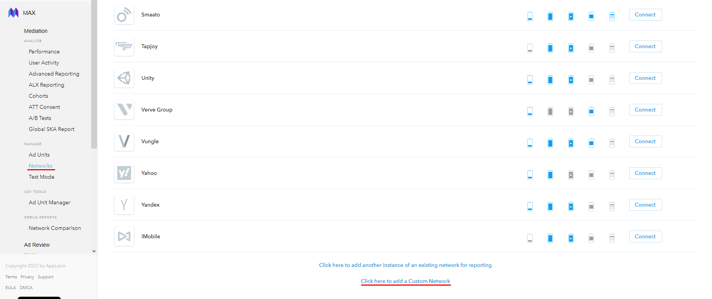
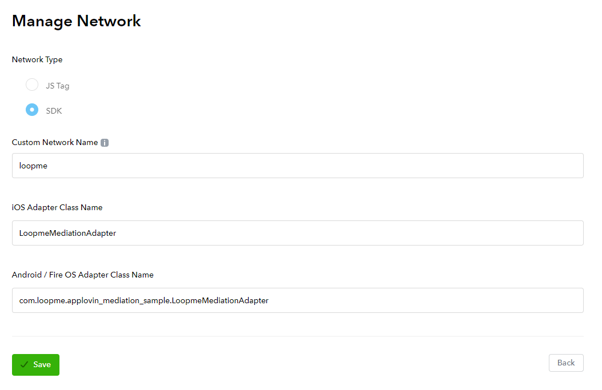

# Android AppLovin Bridge #

1. **[Overview](#overview)**
2. **[Register on LoopMe network](#register-on-loopme-network)**
3. **[Adding LoopMe Android SDK](#adding-loopme-android-sdk)**
4. **[Adding LoopMe's AppLovin Bridge](#adding-loopmes-applovin-bridge)**
5. **[Initialization](#Initialization)**
6. **[Mediate from AppLovin Interstitial to LoopMe Interstitial Ad](#mediate-from-applovin-interstitial-to-loopme-interstitial-ad)**
7. **[Sample project](#sample-project)**

## Overview ##

LoopMe is the largest mobile video DSP and Ad Network, reaching over 1 billion consumers world-wide. LoopMe’s
full-screen video and rich media ad formats deliver more engaging mobile advertising experiences to consumers on
smartphones and tablets. LoopMe supports SDK bridges to ad mediation platforms. The LoopMe SDK bridge allows you to
control the use of the LoopMe SDK via your existing mediation platform.

`LoopMe Android bridge` allows publishers monetize applications using `AppLovin mediation ad platform`.

<b>NOTE:</b> This page assumes you already have account on `AppLovin` platform and integrated with the `AppLovin`
Android SDK

If you have questions please contact us at support@loopme.com.

## Register on LoopMe network ##

To use and setup the SDK bridge, register your app on the LoopMe network via the LoopMe Dashboard to retrieve a unique
LoopMe app key for your app. The app key uniquely identifies your app in the LoopMe ad network (Example app key:
51bb33e7cb). To get an appKey visit the **[LoopMe Dashboard](https://app.loopme.com/login/)**, and
follow **[instruction](https://docs.google.com/document/d/1No1rVSpD2XLvG6nniwGjRb48Q0kVmYIkSgnlbhRXx5M/edit#)**.<br>
You will need the app key during next steps of integration.

## Adding LoopMe Android SDK ##

* Add the following to your `build.gradle`:

```groovy
dependencies {
    implementation files('libs/loopme-sdk-release.aar')
}
```

## Adding LoopMe's AppLovin Bridge ##

Download `LoopmeMediationAdapter` class and move it to your project.

## Initialization ##

Make sure `LoopMeSdk` is [initialized](https://github.com/loopme/android-united-sdk/wiki/Initialization) before using
AppLovin.

## Mediate from AppLovin Interstitial to LoopMe Interstitial Ad ##

<b>Configure Ad Network Mediation on AppLovin</b>
<br><b>NOTE:</b> This page assumes you already have account on AppLovin and Ad unit(s)

* Click <b>Networks</b> in Manage group then <b>Click here to add a Custom Network</b>

<p></p>

<p></p>

* Click <b>In Ad Unit's setting set loopme's appkey in PlacementId field</b>
Enter the appkey and real eCPM that you have got after LoopMe publisher team approval. Click Continue.<br>
Note: you find eCPM on the LoopMe Dashboard > Apps & Sites > Ad Spot information.

* You will get:

<p></p>

Parameter: enter the app key value you received after registering your Ad Spot on the LoopMe dashboard. <br>E.g. '
298f62c196'.<br><br>

* Load

```java
interstitialAd = new MaxInterstitialAd(APPLOVIN_UNIT_ID, this);
```

* Show

```java
interstitialAd.showAd();
```

## Sample project ##

Check out our `applovin_mediation_sample` as an integration example.