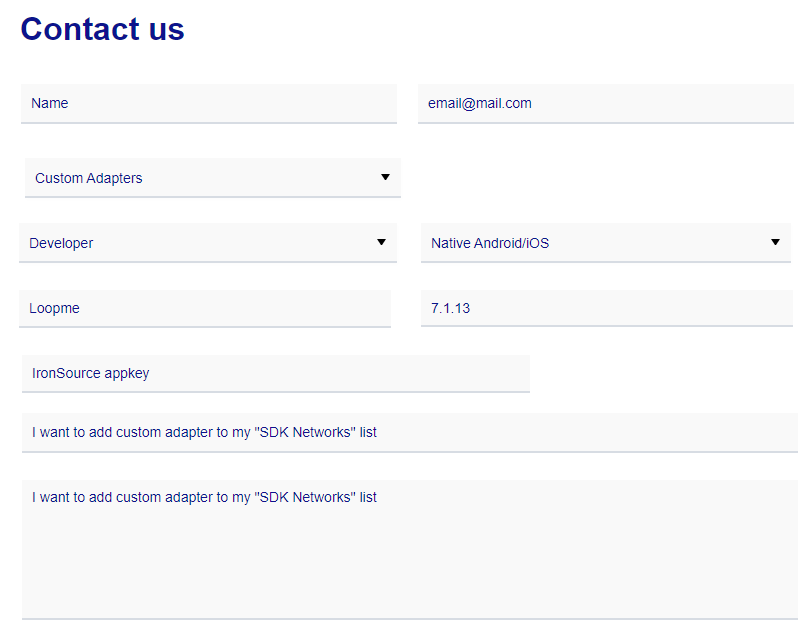
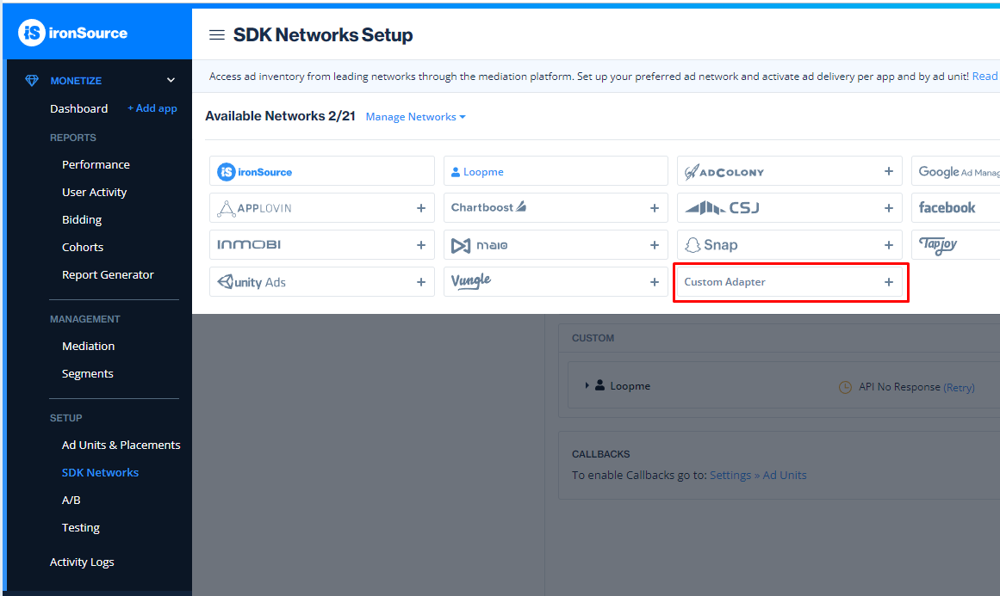
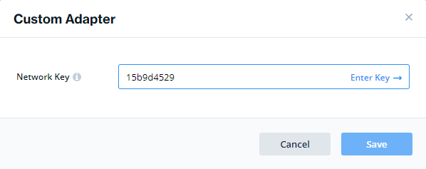

# Android IronSource Bridge #

1. **[Overview](#overview)**
2. **[Register on LoopMe network](#register-on-loopme-network)**
3. **[Adding LoopMe Android SDK](#adding-loopme-android-sdk)**
4. **[Adding LoopMe's IronSource Bridge](#adding-loopmes-ironsource-bridge)**
5. **[Initialization](#Initialization)**
6. **[Mediate from IronSource Interstitial to LoopMe Interstitial Ad](#mediate-from-ironsource-interstitial-to-loopme-interstitial-ad)**
7. **[Sample project](#sample-project)**

## Overview ##

LoopMe is the largest mobile video DSP and Ad Network, reaching over 1 billion consumers world-wide. LoopMe’s full-screen video and rich media ad formats deliver more engaging mobile advertising experiences to consumers on smartphones and tablets.
LoopMe supports SDK bridges to ad mediation platforms. The LoopMe SDK bridge allows you to control the use of the LoopMe SDK via your existing mediation platform.

`LoopMe Android bridge` allows publishers monetize applications using `IronSource mediation ad platform`.

<b>NOTE:</b> This page assumes you already have account on `IronSource` platform and integrated with the `IronSource` Android SDK

If you have questions please contact us at support@loopme.com.

## Register on LoopMe network ##

To use and setup the SDK bridge, register your app on the LoopMe network via the LoopMe Dashboard to retrieve a unique LoopMe app key for your app. The app key uniquely identifies your app in the LoopMe ad network (Example app key: 51bb33e7cb). Please ask POC in Loopme to register your app/placement and provide the appKey.<br>
You will need the app key during next steps of integration.

## Adding LoopMe Android SDK ##

* Add the following to your `build.gradle`:
```groovy
dependencies {
        implementation files('libs/loopme-sdk-release.aar')
        }
```

## Adding LoopMe's IronSource Bridge ##

Download `LoopmeCustomAdapter`, `LoopmeCustomRewardVideo` and `LoopmeCustomInterstitial` classes and move it to `com.ironsource.adapters.custom.loopme` package in your project.

## Initialization ##

Make sure `LoopMeSdk` is [initialized](https://github.com/loopme/android-united-sdk/wiki/Initialization) before using IronSource.

## Mediate from IronSource Interstitial to LoopMe Interstitial Ad ##

<b>Configure Ad Network Mediation on IronSource</b>
<br><b>NOTE:</b> This page assumes you already have account on IronSource and Ad unit(s)
* To enable your account for custom adapters you need to <a href="https://developers.is.com/submit-a-request">contact IS support </a>, custom network configuration must be enabled for the publisher on IronSource backend since it's closed beta.
<p></p>

* Click <b>Add Custom Adapter.</b>
<p></p>
network key is 15bd4aa9d
<p></p>

Class Name should be: 'com.ironsource.adapters.custom.loopme.LoopmeCustomAdapter'. <br>
Parameter: enter the app key value you received after registering your Ad Spot on the LoopMe dashboard. <br>E.g. '298f62c196'.<br><br>

* Load
```java
LoopmeCustomAdapter.setWeakActivity(this);
LoopmeCustomAdapter.setLoopmeAppkey(loopmeAppKey);
IronSource.init(this, appKey, IronSource.AD_UNIT.INTERSTITIAL);
IronSource.setInterstitialListener(interstitialListener);
IronSource.loadInterstitial();
```

* Show
```java
IronSource.showInterstitial();
```

## Sample project ##

Check out our `ironsource-mediation-sample` as an integration example.
